## Processo de Deploy no GCP

### Serviços utilizados: VPC, Cloud DNS, Computer Engine, Cloud SQL

### Tecnologias utilizadas: PHP, Laravel, Inertia, Vue, PostgreSQL, Nginx, PHP-FPM

### 1 - Criar uma conta no console do GCP

### 2 - Criar um projeto no GCP, nesse exemplo vamos chamar o nosso projeto pelo nome: **`php-manaus-lab`**

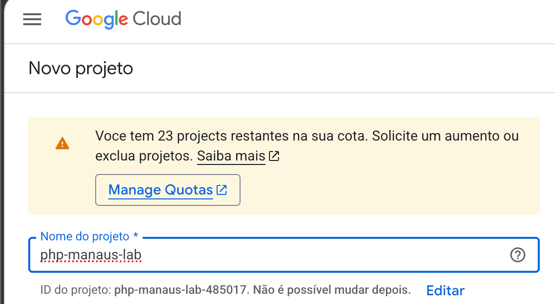

Todos os recursos a seguir serão criados e configurados nesse projeto.

Durante esse processo, é possível que o GCP peça para que você ative algumas APIs.

Conforme imagem abaixo, isso é normal.

Leia e depois ative se fizer sentido, Exemplo:

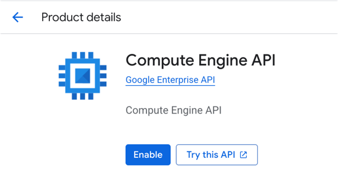

### 3 - Criar uma VPC Personalizada e configurar uma sub-rede.

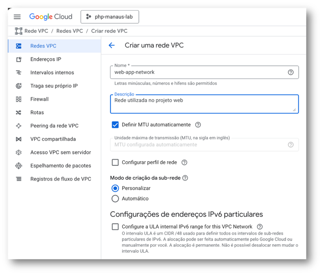

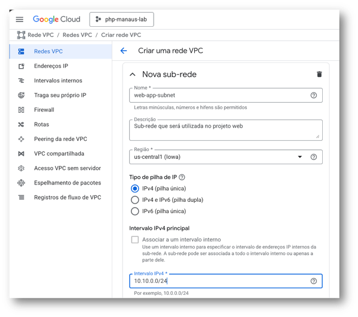

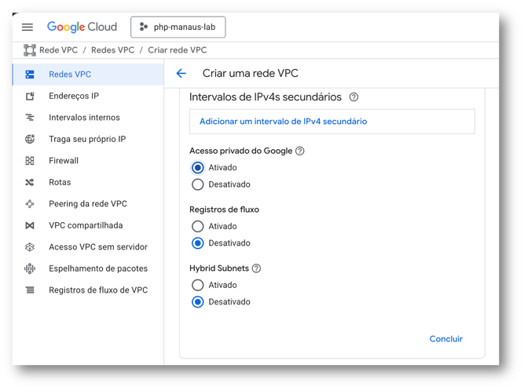

Nome da VPC será: **`web-app-network`**

Descrição: **`Rede utilizada no projeto web`**

Intervalo IPV6 interno de ULA da rede VPC: **`Desativados`**

Modo de Criação da sub-rede: **`Personalizado`**

Nome da Sub-rede: **`web-app-subnet`**

Descrição da Sub-rede: **`Sub-rede que será utilizada no projeto web`**

Região: **`us-central-1`**

Tipo de Pilha de IP: **`IPv4`**

Intervalo IPv4: **`10.10.0.0/24`**

Acesso Privado do Google: **`Ativado`**

Registros de Fluxo: **`Desativado`**

 
Configuração de Regras de Firewall:

Vamos Selecionar quais Protocolos devem ser liberados no Firewall:

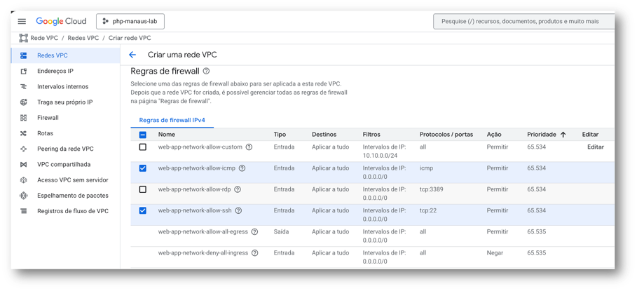

1 - web-app-network-allow-icmp

2 - web-app-network-allow-ssh

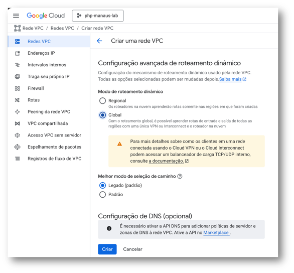

Modo de roteamento dinâmico: **`Global`** 

Clique em Criar

Rede VPC Criada com Sucesso!

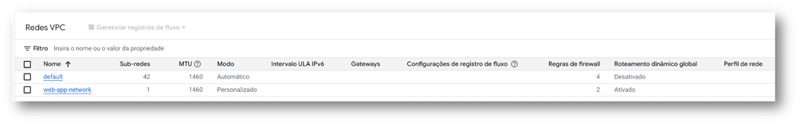

### 4 - Configuração de Chave SSH no GCP
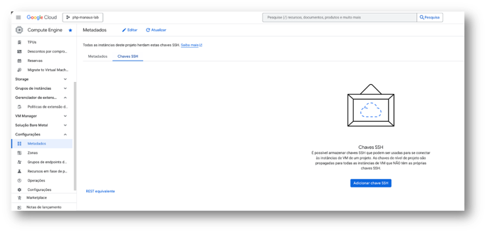
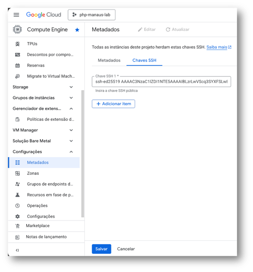

Caso você ainda não tenha uma chave SSH Publica e Privada na sua máquina, você precisará criar uma.

Criar Diretório no padrão: `mkdir .ssh`

Gerar Chaves Publicas e Privadas: `ssh-keygen -m PEM -N '' -f ~/.ssh/id_rsa`

Visualizar o Conteúdo da Chave: `cat ~/.ssh/id_rsa.pub`

No meu caso, no meu computador, minha chave publica eu pego assim: `cat ~/.ssh/id_ed25519.pub`

Depois colocar no campo Chave SSH no GCP.

### 5 - Criar o Servidor de Aplicação Ubuntu 24.04 utilizando o Computer Engine e adicioná-lo a rede da VPC

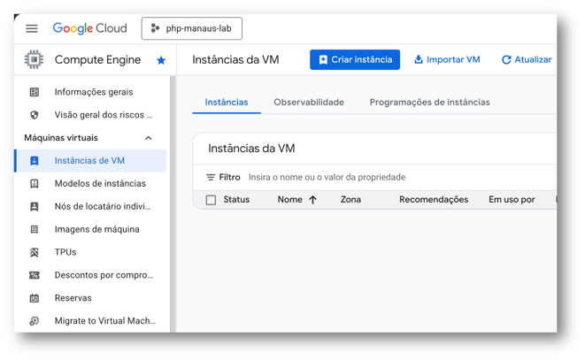
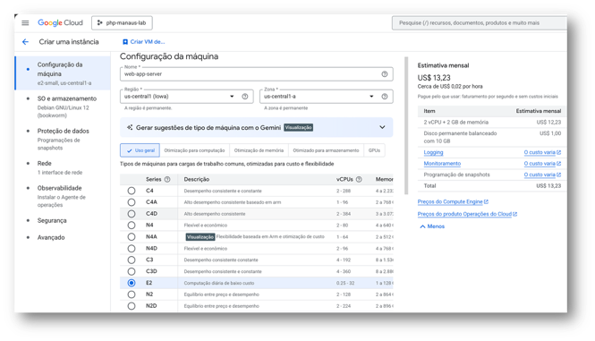
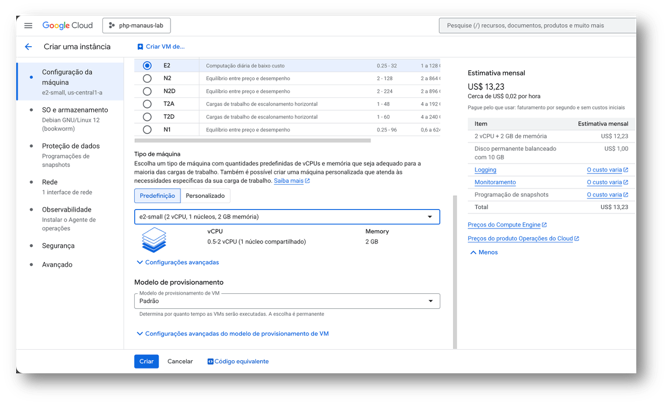
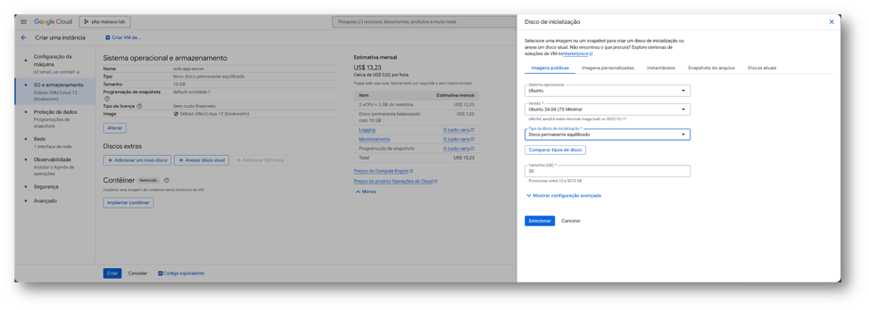
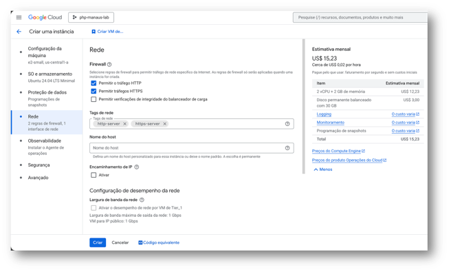
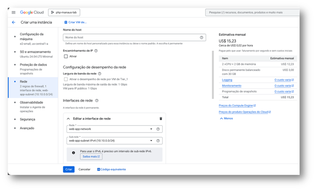
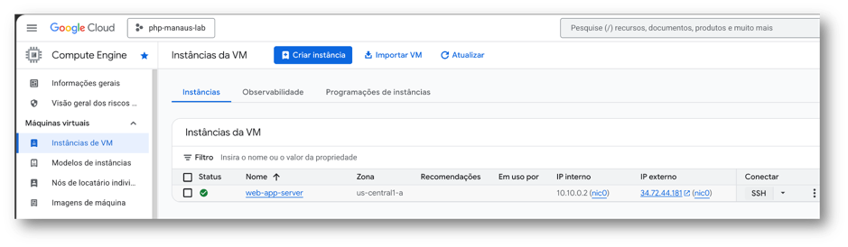

Nome da Computer Engine: **`web-app-server`**

Região: **`us-central1 (Iowa)`**

Zona: **`us-central1-a`**

Tipo: **`e2-small`**

Ubuntu: **`24.04 x64`**

CPU: **`1 VCPU`**

RAM: **`2GB`**

Disco Permanente Equilibrado: **`30GB`**

Em Interfaces de rede escolha a VPC criada anteriormente: **`web-app-network`**

Em Sub-rede escolha a sub-rede criada anteriormente: **`web-app-subnet`**

Clique em Criar

### 6 - Atribuir um nome de DNS na rede interna do VPC para o Servidor de Aplicação

Caso seja necessário ative a API Cloud DNS no projeto.

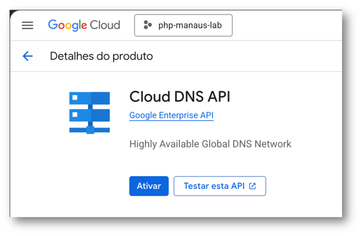

Vamos agora criar a nossa zona DNS:

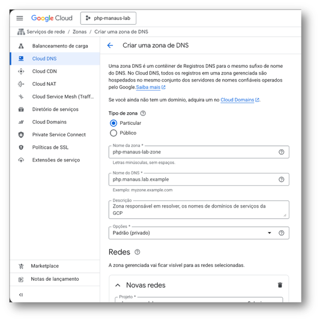
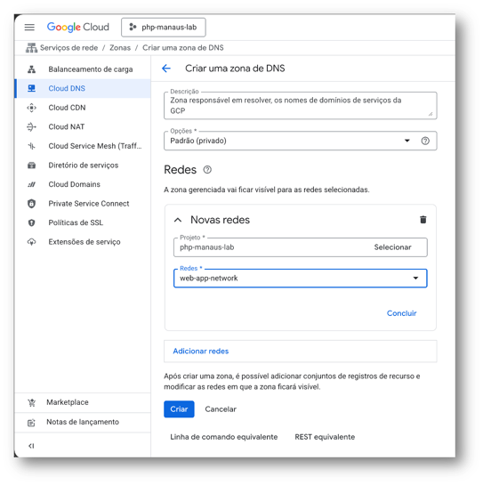
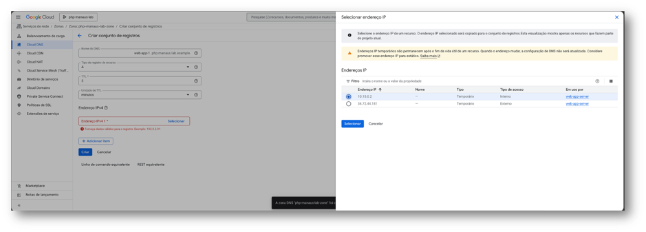

Nome da Zona: **`php-manaus-lab-zone`**

Nome do DNS: **`php.manaus.lab.example`**

Descrição: **`Zona responsável em resolver, os nomes de domínios de serviços da GCP`**

Opções: **`Padrão Privado`**

Rede: **`web-app-network`**


Adicionar o Registro de DNS do Servidor de Aplicação

Nome de DNS do Servidor de aplicação: **`web-app-1`**

Tipo de Registro: **`A`**

TLL: **`5`**

Unidade de TLL: **`minutos`**

Endereço IPV4: **`Selecionar o IP Interno do Servidor de Aplicação web-app-server`**

Clique em Criar 

Pronto, agora o nosso Servidor de Aplicação pode ser acessado internamente pelo DNS: **`web-app-1.php.manaus.lab.example.`**

### 7 - Reservar um IP Externo Estático
Caso o nosso Servidor de Aplicação reinicie, ele poderá acabar recebendo um novo IP Externo/Publico.

Para evitar isso, precisamos reservar um IP Externo e atribuí-lo ao nosso Servidor de Aplicação.

Vamos fazer isso no console do GCP.

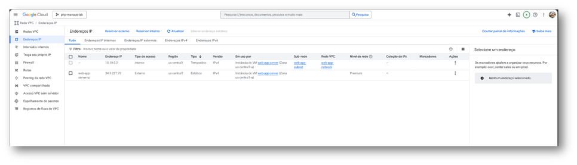

Clique em **`Reservar externo`**

E preencha os campos:

Nome: **`web-app-server-ip`**

Descrição: **`Reservar de IP para o Servidor de Aplicação Web`**

Nível de Serviço de Rede: **`Premium`**

Versão do IP: **`IPv4`**

Tipo: **`Regional`**

Anexado: **`web-app-server`**

### 8 - Conectar ao servidor de Aplicação via SSH para testar
Você pode se conectar pela interface do Computer Engine ou pelo terminal.

Para se conectar via terminal, utilize o comando abaixo e lembre-se de alterar as informações para seu contexto.

Comando:
```
ssh usuario@ip-publico
```

### 9 - Atualizar os pacotes do  Ubuntu
Vamos logar como usuário root e atualizar os pacotes do Ubuntu.

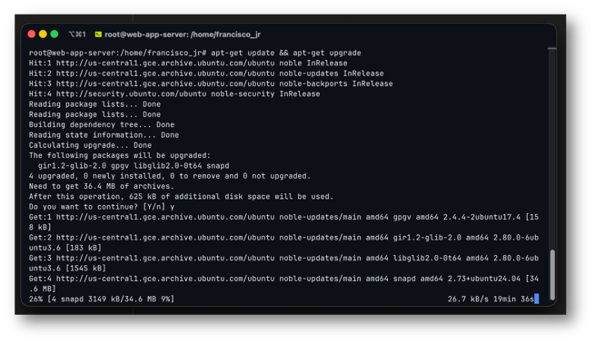

comando:
```
sudo su
```

Atualizar os pacotes do Ubuntu

comando:
```
apt-get update && apt-get upgrade
```

Vamos aproveitar e instalar também instalar o vim para modificar arquivos de texto.

comando:
```
apt-get install vim -y
```

### 10 - Instalação do Nginx
Ainda logado como root vamos continuar

comando:
```
apt-get install nginx
```

Verifique se o serviço está sendo executado.

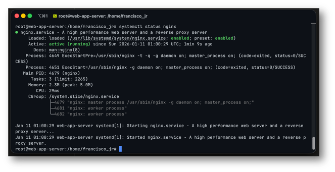

comando:
```
systemctl status nginx
```

Teste acessando o IP via navegador

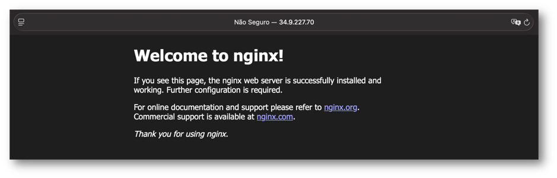

Se tiver esquecido o IP publico, execute o comando abaixo ou pegue no console do GCP no Computer Engine.

comando:
```
wget -qO- icanhazip.com
```

### 11 - Instalação das pedendências básicas, PHP 8.4, PHP-FMP e Composer
Vamos começar instalando as dependências básicas como root

comando:
```
sudo apt install -y \
ca-certificates \
apt-transport-https \
software-properties-common \
lsb-release \
curl \
unzip \
git
```

Agora vamos adicionar os repositórios do PPA ao Ubuntu.

comando:
```
sudo add-apt-repository ppa:ondrej/php -y
```

```
sudo apt update
```

Instalar PHP 8.4 + PHP-FPM + Extenções exigidas pelo Laravel:

comando:
```
sudo apt install -y \
php8.4 \
php8.4-fpm \
php8.4-cli \
php8.4-common \
php8.4-mbstring \
php8.4-xml \
php8.4-bcmath \
php8.4-curl \
php8.4-zip \
php8.4-gd \
php8.4-intl \
php8.4-soap \
php8.4-opcache \
php8.4-readline \
php8.4-pgsql \
php8.4-mysql \
php8.4-redis
```

Verificar a instalação do PHP.

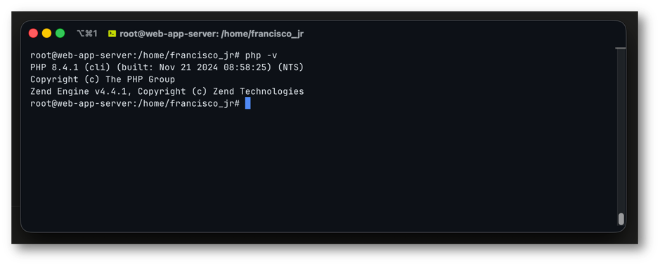

comando:
```
php -v
```

Verificar a instalação do PHP-FPM.

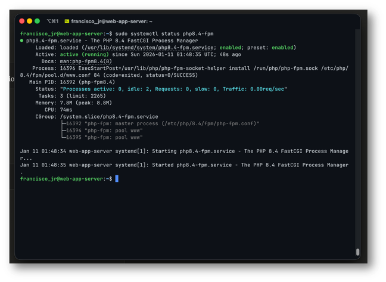

comando:
```
sudo systemctl status php8.4-fpm
```

Caso o PHP-FPM não estiver ativo, você rodar os comandos abaixo.

comando:
```
sudo systemctl enable php8.4-fpm
```
```
sudo systemctl start php8.4-fpm
```

Agora vamos realizar a instalação do Composer, também não estando logado como root:

vamos executar os seguintes comandos:

```
cd /tmp
```
```
curl -sS https://getcomposer.org/installer | php
```
```
sudo mv composer.phar /usr/local/bin/composer
```
```
sudo chmod +x /usr/local/bin/composer
```

Comando para verificar ser o Composer pode ser executado.

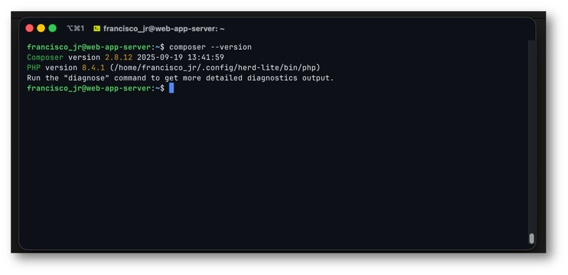

comando:
```
composer --version
```

Vamos instalar também um client do PostgreSQL para usarmos no futuro e testar se conseguimos acessar o banco de dados.

comando:
```
sudo apt install -y postgresql-client
```

vamos verificar se o cliente foi instalado com sucesso.

comando:
```
psql --version
```

Habilitar o PHP-FPM no NGINX, logue como root.

comando:
```
sudo su
```

Vamos navegar até o diretório padrão do Nginx e criar um arquivo .php para testar

comando:
```
cd /var/www/html/
```
```
vim test.php
```

Vamos adicionar esse conteúdo de teste dentro do arquivo test.php:
```
<?php
phpinfo();
```

Vamos testar no navegador usando /test.php

nesse momento vamos ver que invés do código PHP ser executado, na verdade o navegador baixou o arquivo

Isso acontece porque o Nginx não sabe que ele deve, na verdade enviar os arquivos PHP para serem executados pelo PHP-FPM

Vamos corrigir isso.

Vamos configurar o arquivo default do Nginx:

comando:
```
vim /etc/nginx/sites-enabled/default
```

vamos adicionar esse trecho de código logo após o location {...}

isso vará com que o Nginx passe a emcaminhar a execução dos arquivos PHP para o PHP-FPM.

```
location ~ \.php$ {
    fastcgi_pass unix:/var/run/php/php8.4-fpm.sock;
    fastcgi_param SCRIPT_FILENAME $realpath_root$fastcgi_script_name;
    include fastcgi_params;
}
```

Após salvar o arquivo via vim `:wq`

Vamos checar a sintaxe.

comando:
```
nginx -t
```

Se estiver tudo certo, vamos reiniciar o Nginx.

comando:
```
systemctl restart nginx
```

Pronto, agora podemos testar novamente no navegador.

Se tiver esquecido o IP publico.

comando:
```
wget -qO- icanhazip.com
```

já devemos ser capazes de ver o código PHP executado pelo Nginx.

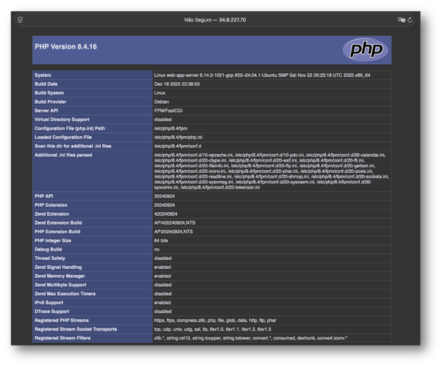

### 12 - Criar o Servidor de Banco de Dados PostgreSQL 17 utilizando o Cloud SQL e adicioná-lo a rede da VPC

Escolhendo Edição do Cloud SQL

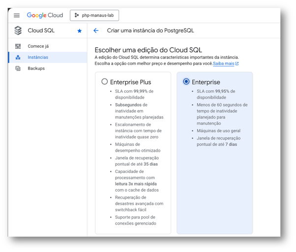

Configurando Versão do Banco de Dados

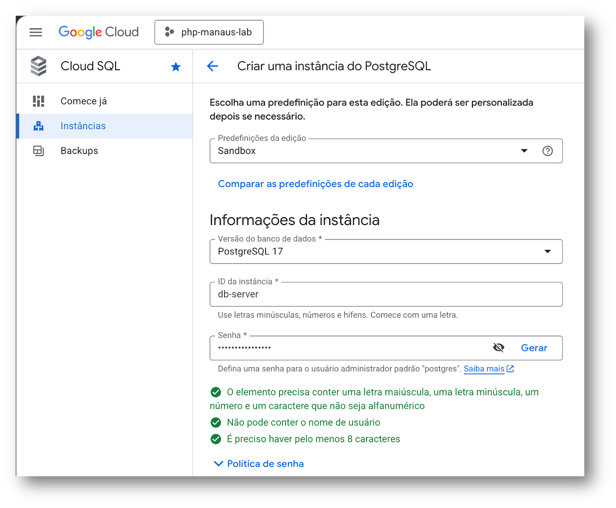

Disponibilidade Cloud SQL

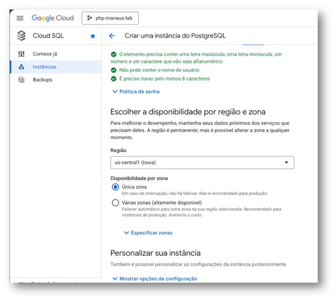

Configurando Processador e Memória

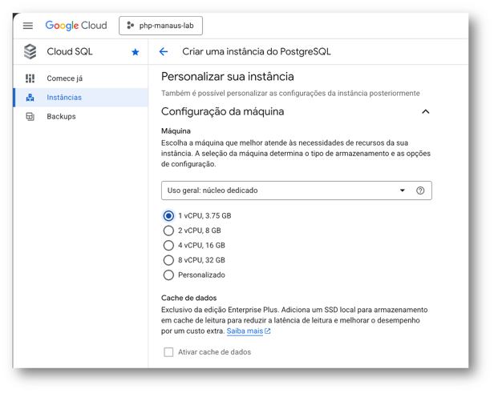

Configurando Rede do Cloud SQL

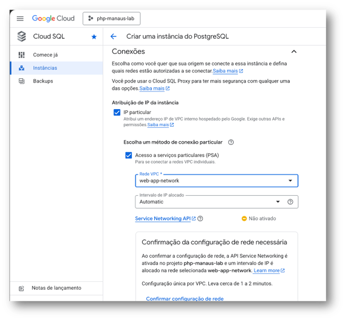
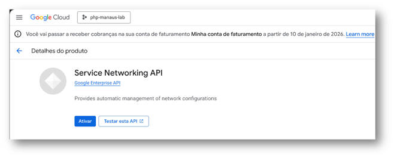
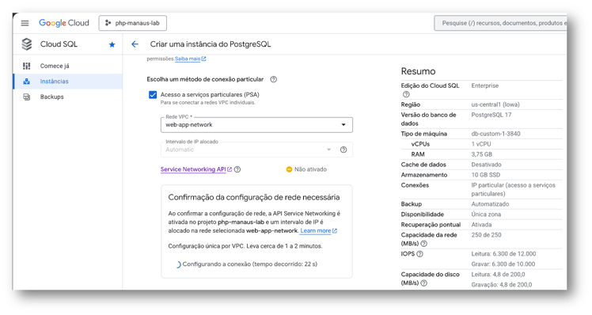
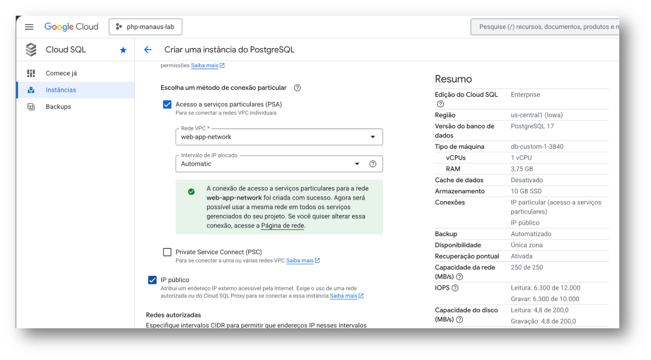

Configurando Exclusão do Cloud SQL

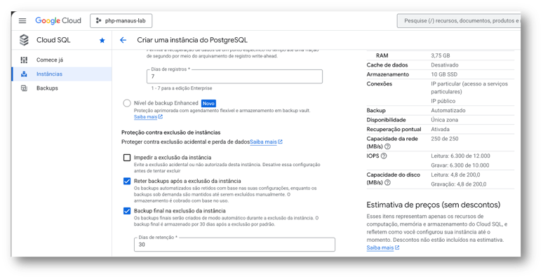

Criando Usuário da Aplicação

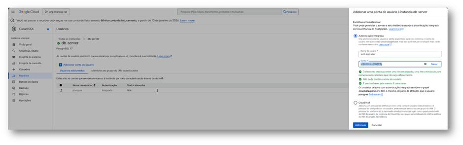

Criando Banco de dados da Aplicação

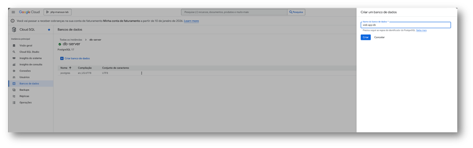

Nome da Instancia do Cloud SQL: **`db-server`**

Usuário: **`postgres`**

Senha: V43<J@)`f*fG4yR=

Criando Usuário para a aplicação:

Usuário: **`web-app-user`**

Senha: ld3XGOI6m[7Q$P#j

Banco de Dados: **`web-app-db`**

Nome DNS atribuído na rede na rede: **`db-server-1.php.manaus.lab.example.`**

IP: **`172.17.128.3`** pode mudar de acordo com o seu ambiente.

Vamos testar se conseguimos conectar a partir do servidor de Aplicação.

comando:
```
psql -h db-server-1.php.manaus.lab.example. -p 5432 -U web-app-user -d web-app-db
```

Já devemos ser capaz de ver o schema public utilizando.

comando:
```
\dn
```

### 15 - Realizar a Instalação de uma aplicação Laravel Padrão

Por questões de segurança e organização, vamos primeiro adicionar e configurar um usuário chamado `web` no nosso Servidor de Aplicação Ubuntu.

Usuário: **`web`**

Senha: PHP-manaus-lab!@

Para fazer isso precisamos rodar o comando abaixo logado como root.

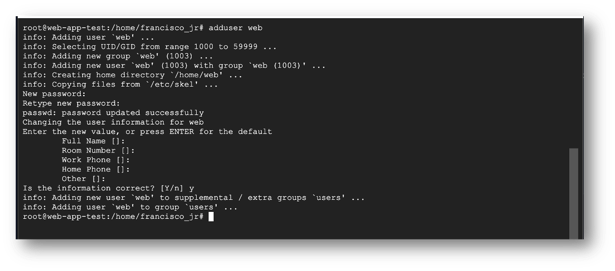

comando: 
```
adduser web
```

Agora vamos logar com o usuário web.

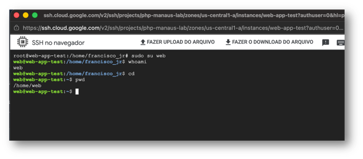

comando:
```
sudo su web
```

Vamos verificar se conseguimos logar execute.

comando:
```
whoami
```

Vamos agora para a parta home do usuário web: `cd`

Verificar se está no home do usuário web.

comando:
```
pwd
```

Vamos criar uma pasta onde irá ficar a nossa aplicação Laravel futuramente:

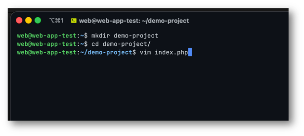
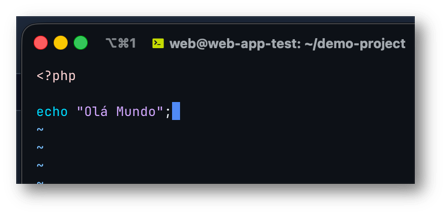

Execute esse comando para criar a pasta:

comando:
```
mkdir demo-project
```

entre na pasta criada:

comando:
```
cd demo-project
```

Crie o arquivo usando o vim.

comando:
```
vim index.php
```

Vamos adicionar esse conteúdo ao arquivo index.php:

```
<?php
echo 'Olá Mundo!';
```

Vamos verificar em que grupo o nosso usuário está no momento, vamos fazer isso logo como usuário root

comando:
```
sudo su
```

comando:
```
groups web
```

Agora vamos adiciona o nosso usuário web ao grupo www-data,

comando:
```
usermod -aG www-data web
```
Vamos verifica novamente:

comando:
```
groups web
```

Agora vamos voltar a logar como web e aplicar as permissões no diretório:

comando: 
```
sudo su web
```

Voltar para home: `cd`
     
Aplicar as permissões.

comando:
```
chmod 755 /home/web
```

Agora precisamos configurar o Nginx para que ele reconheça esse diretório dentro da home do usuário web, como caminho raiz do projeto.

Vamos logar novamente como root

comando:
```
sudo su
```

Vamos editar o arquivo de configuração do Nginx.

comando:
```
vim /etc/nginx/sites-enabled/default
```

Vamos mudar o caminho da propriedade root de  **`/var/www/html;`** para **`/home/web/demo-project;`**

E vamos adicionar a string **`index.php`** no final da lista de Index:

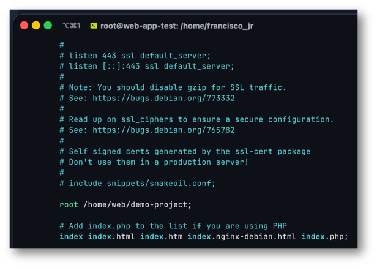

Vamos atualizar o PHP-FPM para que ele também reconheça o projeto e a suas permissões, vamos editar com o vim.

comando:
```
vim /etc/php/8.4/fpm/pool.d/www.conf
```

Precisamos alterar o user e group de www-data para web na seção [www]

Antes

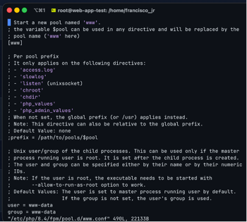

Depois

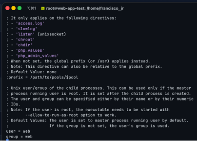

Agora precisamos reiniciar o nginx e o php-fpm

Mas antes verifique se a sintaxe do Nginx está ok

comando:
```
nginx -t
```

Se estiver tudo certo, vamos reiniciar o Nginx e o PHP-FPM.

comando:
```
systemctl restart nginx
```
```
systemctl restart php8.4-fpm
```

Vamos testar acessando no navegador

Se fizemos tudo certo, conseguimos visualizar o Olá Mundo!

Agora vamos remover a diretório demo-projects para trazer de fato a nossa aplicação Laravel demo-project

vamos remover como usuário web

comando:
```
rm -rf demo-project/
```

Como a nossa aplicação de demo-projeto Laravel está no Github.

Vamos precisar clonar-la, e para clonar precisamos de um SSH Key.

Vamos gerar um chave SSH para nosso Servidor de Aplicação conseguir clonar nosso projeto Laravel.

logado como usuário web execute o seguinte comando:

lembre-se de alterar o email para o seu.

comando:
```
ssh-keygen -t ed25519 -C "francisco_jr@outlook.com"
```

comando para pegar a chave publica gerada.

comando:
```
cat /home/web/.ssh/id_ed25519.pub
```

Criar chave no Github e adicionar a nossa chave publica.

Clonar o repositório.

comando:
```
git clone git@github.com:franciscorjr/demo-project.git demo-project
```

Vamos precisar agora configurar nosso Nginx para trabalhar com o Laravel.

Na documentação oficial do Laravel, existe um arquivo de configuração para o Nginx recomendado.

Podemos consulta-lo no seguinte link: https://laravel.com/docs/12.x/deployment#nginx

Logado novamente como root, vamos editar o arquivo seguindo a documentação oficial do Laravel.

comando:
```
vim /etc/nginx/sites-enabled/default
```

vamos adicionar ao arquivo:

Logo após o Index já atualizado:

```
charset utf-8;
```

Dentro de Location vamos atualizar o bloco try_files para:

```
try_files $uri $uri/ /index.php?$query_string;
```

Entre os dois primeiros locations {...} vamos adicionar:

```
location = /favicon.ico { access_log off; log_not_found off; }
location = /robots.txt  { access_log off; log_not_found off; }

error_page 404 /index.php;
```

e após o último location {...} vamos adicionar:
```
location ~ /\.(?!well-known).* {
    deny all;
}
```

após editar e salvar verifique com: `nginx -t`

se estiver tudo ok reinicie o nginx.

comando:
```
systemctl restart nginx
```

Agora como usuário web novamente, **`sudo su web`**

vamos entrar na pasta demo-project, copiar o arquivo .env.example para .env e executar o composer install

comando:
```
cd
```
```
cd demo-project/
```
```
cp .env.example .env
```
```
composer install
```

O arquivo .env desse projeto já está configurado para conectar ao banco de dados PostgreSQL criado anteriormente.

lembre-se de atualizar o seu conforme a suas próprias credênciais.

Gere a chave através do artisan

comando:
```
php artisan key:generate
```

Execute esse comando para gerar os links simbólicos e para acessar os arquivos públicos.
```
php artisan storage:link
```

Rode as migrations
```
php artisan migrate
```

Como o nosso projeto utiliza o Inertia.js e o Vue.js precisamos instalar o Node.js e o NPM para buildar os assets do front-end.

Vamos fazer isso instalando o NVM.

Instalar como usuário `web` o NVM para buildar os assets do front-end

comando:
```
curl -o- https://raw.githubusercontent.com/nvm-sh/nvm/v0.40.1/install.sh | bash
```

Atualizar o bash

comando:
```
source ~/.bashrc
```

Instalar Node LTS

comando:
```
nvm install --lts
```

Instalar as dependências do front-end e buildar

comando:
```
npm install
```
```
npm run build
```

Se tudo estiver ok, agora é só correr para o abraço e testar no navegador.

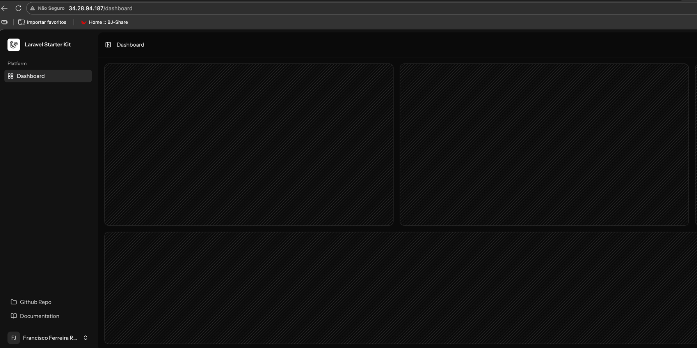

## Bonus - Deploy usando o App Engine

Para realizar deploy utilizando o App Engine, primeiramente precisamos ativar o App Engine.

Vamos entrar no console do GCP e ativar o App Engine.

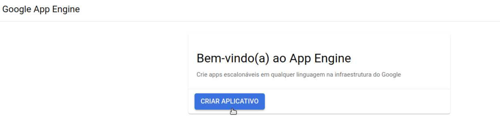

Selecione a Conta de Serviço padrão da App Engine.

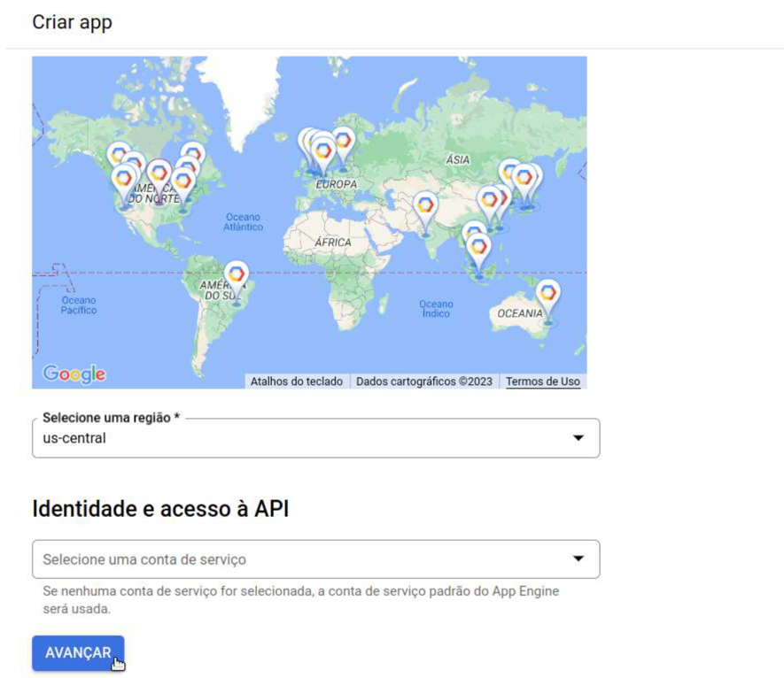

Após realizarmos a ativação da App Engine, precisamos adicionar algumas permissões a ela.

Vamos até o IAM e vamos adicionar algumas permissões para a App Engine.

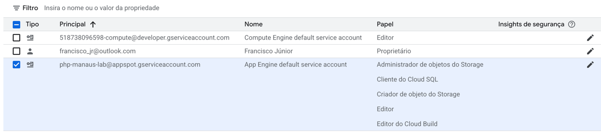

As permissões são: 

1 - Administrador de objetos do Storage

2 - Cliente do Cloud SQL

3 - Criador de objeto do Storage

4 - Editor do Cloud Build

5 - Editor "essa permissão já é padrão"

Também precisamos ativar o Cloud SQL Admin API.


O próximo passo é baixar e instalar o SDK do GCP no nosso computador para podermos fazer o deploy.

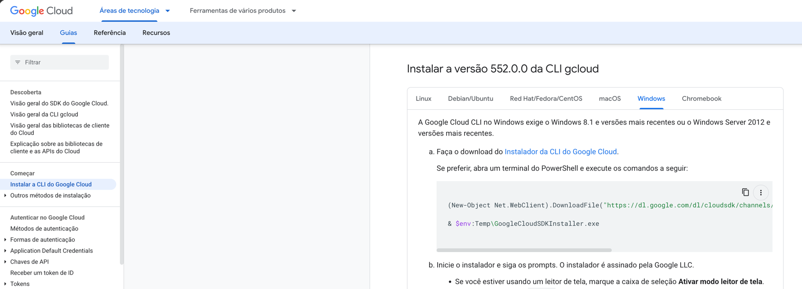

Realize o download e instale no seu computador seguindo o passo a passo.

Link: https://docs.cloud.google.com/sdk/docs/install-sdk?hl=pt-br#windows

Se você estiver utilizando o Windows, lembre-se de adicionar o path da instalação nas variáveis de ambiente.

Para que você possa executar o comando gcloud no seu terminal de qualquer diretório de forma global.

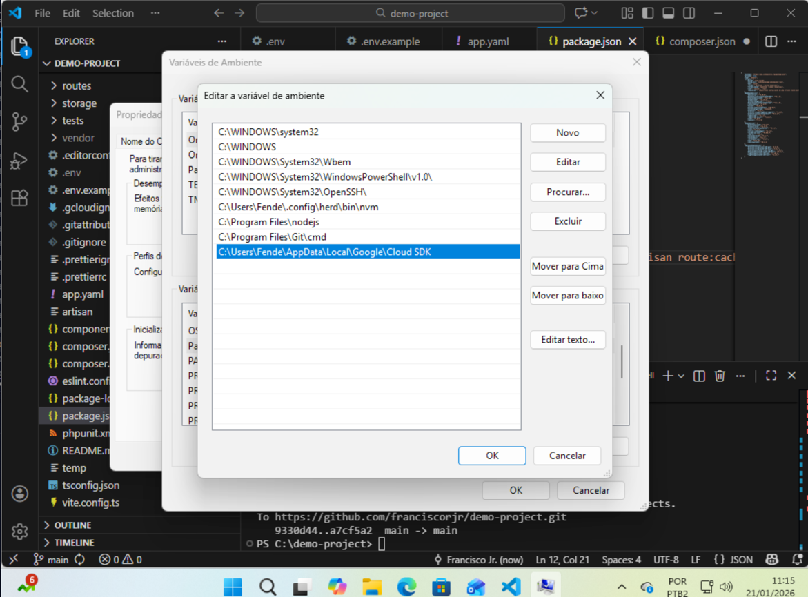

Reinicie o Windows para que essa configuração entre em vigor.

Pronto, agora podemos realizar o deploy.

O projeto `demo-project` já possui os arquivos necessários para realizar o deploy.

Que são os arquivos `app.yaml` e `.gloudignore`

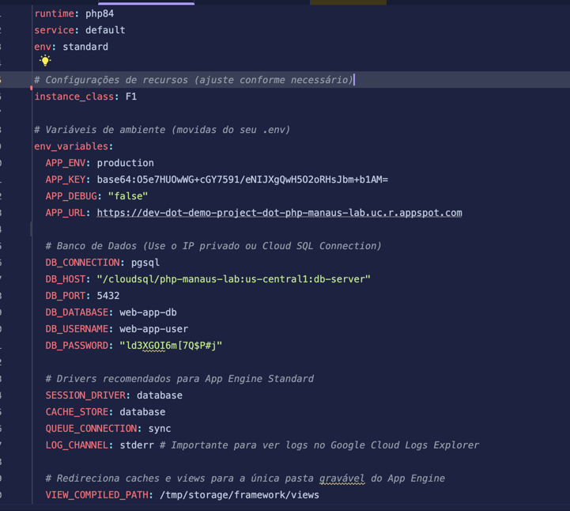

Fique a vontade para alterar os arquivos conforme a sua necessidade.

Entre na pasta do projeto demo-project, lá temos um comando para fazer o deploy no App Engine personalizado.

comando:
```
npm run-script deploy-dev
```

Aguarde o deploy terminar e abra o link gerado pelo App Engine.

Se deu tudo certo, você já deve ser capaz de usar a aplicação.

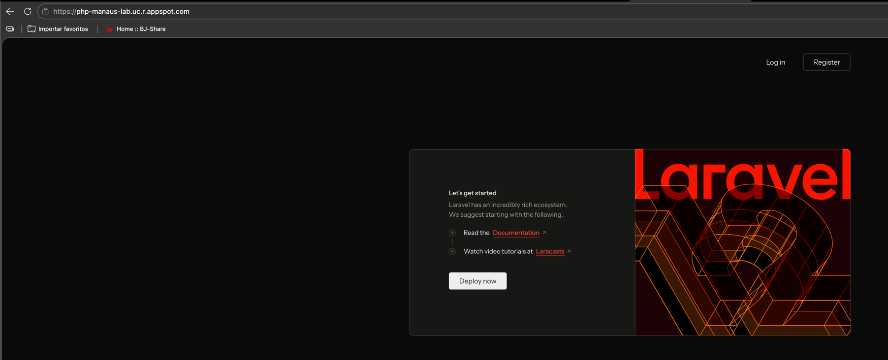


